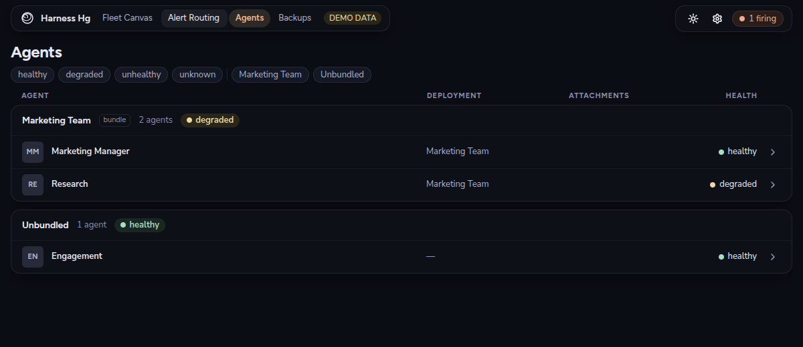
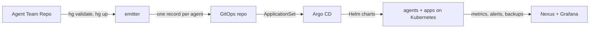

# Harness Hg

Run a team of AI agents on Kubernetes from files in Git.

[](https://github.com/factory-level/harness-hg/actions/workflows/ci.yaml)
[](LICENSE)
[](https://factory-level.github.io/harness-hg/docs/)

You describe an agent team in a repository: who the agents are, what they need, what they
ship. Harness Hg turns that into running agents with monitoring, alerts, backups and network
access, and shows you the result in Nexus UI.

[](https://factory-level.github.io/harness-hg/demo/)

*Nexus UI with demo data. [Open the live demo](https://factory-level.github.io/harness-hg/demo/),
nothing to install.*

## What you get

- **Agents are Git records.** Every agent, app and route is a versioned file checked against a
  frozen schema. A bad declaration fails before anything reaches a cluster.
- **No controller of ours.** Argo CD, Helm and the External Secrets Operator do all the
  reconciling. When it breaks, it breaks in a way you already know how to debug.
- **Operations included.** The platform supplies Grafana dashboards and alert routes, and runs
  the backup routines and public endpoints your team declares.
- **One CLI, `hg`.** Onboard, bring up, test and prove from one tool. Every `prove` command
  returns pass, fail or *unknown*: a check that could not run never counts as a pass.

## What a team looks like

An agent is a directory. Its name is its identity, and its manifest says what it needs, never
where it runs or what the secret values are:

```yaml
# agents/eve/manager/harness-hg/agent.yaml
apiVersion: hermes-gitops.factorylevel.dev/agent-team/v1alpha1
kind: Agent
harness: eve
envRequires:
  - name: ANTHROPIC_API_KEY
    description: Anthropic API key; agent.ts calls the provider directly.
topology:
  supportedLayouts: [single]
```

The demo team in [`examples/agent-team`](examples/agent-team) is two agents sharing one pod,
a small web app one of them owns, a subagent, a schedule and evals. That is the shape
`hg bundle init` scaffolds for you.

## Quickstart

**Needs:** Linux x86-64 with `bun`, `docker`, `git`, `k3d`, `kubectl`, `helm`, `uv` and
`python3` on your PATH. `hg` names every missing one at once. No accounts, no API keys: the
demo's model key is a placeholder, so the tiers that would call a model report *skipped*.

One host setting, once. k3s inside Docker opens many inotify watchers and the default limit
makes it fail with `too many open files`:

```bash
sudo sysctl -w fs.inotify.max_user_instances=1024
echo fs.inotify.max_user_instances=1024 | sudo tee /etc/sysctl.d/99-inotify.conf
```

Install `hg` and run the demo team:

```bash
git clone https://github.com/factory-level/harness-hg
cd harness-hg/cli && bun install --frozen-lockfile && bun link && cd ..
export PATH="$HOME/.bun/bin:$PATH"

hg dev examples/agent-team      # onboard, up, then watch your edits converge
```

The first run takes 20 to 30 minutes: it creates a k3d cluster, builds the agent runtime
image, and installs the same control plane a hosted environment runs. The same loop, one
verb at a time:

```bash
hg onboard examples/agent-team  # register the team with the local loop
hg validate                     # the contract gate, no cluster needed
hg up                           # k3d + Argo CD + Grafana + the agents
hg test                         # each agent registered and answering
hg status                       # ports for Nexus, Grafana and Argo CD
```

Green looks like `hg test` printing a matrix with no `fail` rows and `hg status` listing a
Nexus port you can open. The full walkthrough, including the edit-and-converge loop, is
[Build an agent team](https://factory-level.github.io/harness-hg/docs/get-started/dev-quickstart/).

## How it works



1. **The team repo** holds declarations only. `hg validate` checks every file against the
   versioned schemas in `agent-bundle-contracts/`.
2. **The emitter** renders each agent into a plain Helm values record and commits it to the
   GitOps repository. Secret values never enter Git; only their names do.
3. **Argo CD** turns each record into an Application. There is nothing to install beyond
   stock Argo CD, Helm and the External Secrets Operator.
4. **Nexus UI** reads what Argo CD, Prometheus and the backup routines report and shows one
   page per concern: fleet, alert routing, agents, backups.

The [Platform](https://factory-level.github.io/harness-hg/docs/platform/) tab of the manual
goes one level deeper on each hop.

## Where next

| You want to | Read |
|---|---|
| Build an agent team and run it locally | [Build an agent team](https://factory-level.github.io/harness-hg/docs/get-started/dev-quickstart/) |
| Create your own team repository | [Agent Team Repo](https://factory-level.github.io/harness-hg/docs/get-started/agent-team-repo/) |
| Host a real environment | [Host an environment](https://factory-level.github.io/harness-hg/docs/get-started/host-an-environment/) |
| See the operations surface without installing anything | [Demo](https://factory-level.github.io/harness-hg/demo/) |
| Every `hg` command | [CLI reference](https://factory-level.github.io/harness-hg/docs/reference/cli/) |

## Status

Beta. It runs a real fleet every day, and the
[roadmap](https://factory-level.github.io/harness-hg/docs/roadmap/) says what is not built
yet. [Open an issue](https://github.com/factory-level/harness-hg/issues) when something is
missing or wrong.

## Repository layout

| Path | What it is |
|---|---|
| `cli/` | `hg`, the operator CLI |
| `agent-bundle-contracts/` | the frozen, versioned schemas every declaration is checked against |
| `harness/` | the agent runtimes the platform can run; Eve is the default |
| `control-plane/` | one chart per component: Argo CD, Grafana, Loki, the event router, Nexus |
| `infra/` | the Pulumi bootstrap for a hosted environment and the GitOps repo scaffold |
| `plugin/gitops_emitter/` | the emitter that renders records into the GitOps repository |
| `nexus-ui/` | Nexus UI, the operations interface |
| `landing/` | the public site and social preview assets |
| `_docs/` | the product manual, design documents and decision records |
| `examples/` | reference repositories, including the demo team |

## Contributing

`make test` is the gate. [`CONTRIBUTING.md`](CONTRIBUTING.md) covers the TypeScript suites it
does not reach, the commit convention the version is derived from, and the documentation
contract in [`_docs/README.md`](_docs/README.md). Security reports go through
[`SECURITY.md`](SECURITY.md).

## License

[Apache 2.0](LICENSE).
