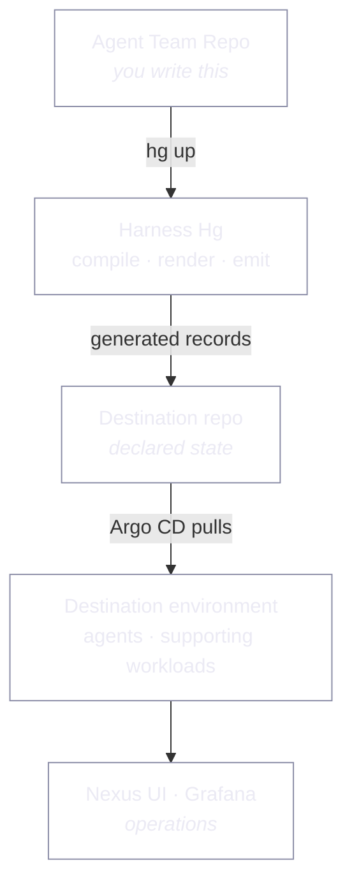

# Harness Hg

**What this page tells you:** what Harness Hg is, who controls what, and where to start.

Harness Hg runs teams of AI agents on Kubernetes from files in Git.

You describe your team in a repository. The platform turns that into running agents.
It adds monitoring, alerts, backups and network access. You build none of that.

Harness Hg adds as few controllers of its own as it can. Argo CD, Helm and the External
Secrets Operator do the work. When something breaks, it breaks in a way you already know
how to debug.

## You never deploy a lone agent

The unit is an **agent application**: the agent plus everything it needs to do its job.
That means its tools, databases, workers, dashboards, backup jobs and the network paths
that reach it.

Everywhere these docs say "application", they mean that whole set.

## How it fits together

Top to bottom: you declare, the platform compiles, Git holds the result, the cluster
pulls it, you watch it. After bootstrap nothing pushes into the cluster. Argo CD pulls.

## Who controls what

| The platform controls | Your Agent Team Repo controls |
|---|---|
| The cluster and the platform services | What the application *is* |
| Which integrations exist | The application's own settings |
| How reconciliation works | Which capabilities it asks for |
| The monitoring baseline | Its own metrics and eval definitions |
| Event routing. An inbound webhook enters the event router, which queues it and hands it to your agent | Which events it produces and consumes |
| Outbound delivery. A webhook or a web request; nothing else today | Where its outbound events go |
| Alert delivery | Alert thresholds and tuning for its own rules |
| How secret values travel | Which secrets it needs, by name |
| How and when backups run | What to back up and how to restore it |
| Which tunnel is used | Which endpoints should be reachable |

The rule: **your repo declares needs; the platform decides how to meet them.** You never
name a provider, a namespace or a URL.

An override can tune *how* your application runs. It cannot change *what it is*.
`topology`, `endpoints` and `requires` belong to the agent. An override that names one is
refused, with an explanation.

## The normal lifecycle

| Stage | What happens | Who |
|---|---|---|
| **Declare** | Write the `harness-hg/` folders: one for the team, one per agent | you |
| **Install** | `hg up` renders each agent's record into the destination repo. A hosted environment does the same on every reconcile tick | you |
| **Reconcile** | Argo CD pulls the record and applies it. A timer on the host keeps the repo current | the platform |
| **Operate** | Watch it in Nexus UI. Get alerts. Take backups | both |
| **Recover** | Restore onto a clean server from a backup you have already tested | you, from a runbook |

## Where to start

| You want to | Read |
|---|---|
| Create your own agent application | [Agent Team Repo](get-started/agent-team-repo.md) |
| Build an agent team and test it locally | [Build an agent team](get-started/dev-quickstart.md) |
| Host a real environment | [Host an environment](get-started/host-an-environment.md) |
| See what the platform gives you | [Platform](platform/index.md) |
| Install your application | [Agent Team Install](agent-team-install/index.md) |
| Run an environment day to day | [Runbooks](runbooks/index.md) |
| Watch the fleet | [Nexus UI](nexus-ui/index.md) |
| Look up a command or a field | [Reference](reference/index.md) |
| Check what a word means | [Vocabulary](vocabulary.md) |

## Beta

Harness Hg is a community tool. I built it to learn how to run agent harnesses for
real, and my own team runs on it.

Expect rough edges. If something is missing or wrong,
[open an issue](https://github.com/factory-level/harness-hg/issues) and ask for it.
