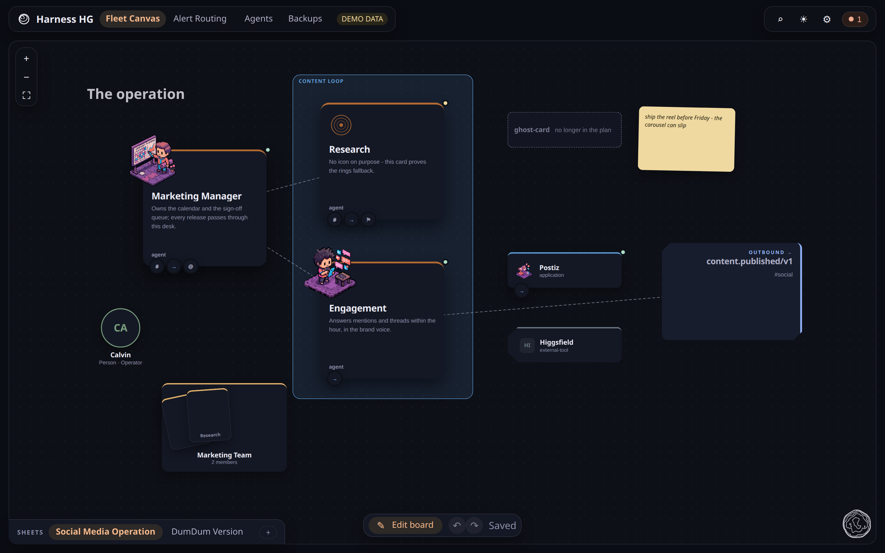
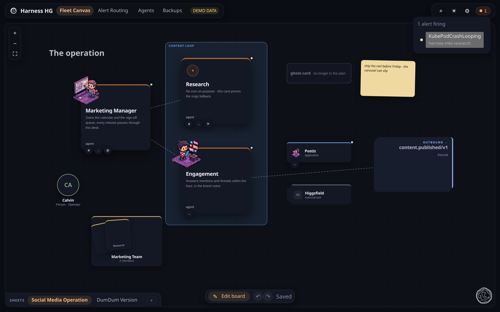

# Nexus UI

**What this page tells you:** what the Fleet Canvas is for, and the one distinction that
makes it make sense.

Nexus UI is the operations surface. The **Fleet Canvas** is its main view: your agents, the
software they run, the people around them, and the relationships between all three, on a
canvas you can arrange. It reads. Nothing you do here changes what is deployed.

## Projected versus authored

| | Projected | Authored |
|---|---|---|
| Comes from | your Agent Team Repo | you, in the browser |
| Written by | `hg nexus emit` | Save |
| Examples | agents, applications, health, links, people and groups | positions, notes, shapes, text, lines, sheets |
| To change it | edit the repository | edit the canvas |

**Nothing you author on the canvas reaches the repository.** The plan is what the fleet
deploys; the canvas is how you think about it. A drawn object has no health source, so it
never turns green. That is correct.

## Where health comes from

Status on a card is projected, never authored, and never optimistic. A source nobody
configured reads `unknown`. A card with no health dot has no health source. The header's
operations pill counts what is firing:

## Sheets

A workspace holds up to eight sheets. Each keeps its own objects, layout and zoom. Create one
from the tab row's `+`. While editing, the trash control beside it deletes the current
sheet after a confirmation; a workspace always keeps at least one, and Undo restores it
until you save. Renaming, duplicating and reordering are not built yet. Deep-link with
`#/fleet/<sheetId>`.

## Saving

**Saves are manual.** The save is a compare-and-set: if someone else saved first, yours is
rejected and you choose *load theirs* or *overwrite*. Unsaved work is lost if you leave the
tab.

On first open, one sheet is built from the plan's own view. Relationships from the plan
become ordinary editable lines once; delete one and it stays deleted.

## Where to go next

- [Objects and interactions](objects.md), what you can place and do
- [The other views](views/index.md), Alert Routing, Agents, Backups, System, Avatars
- [Nexus UI on the platform](../platform/nexus.md), authentication and eval publishing
