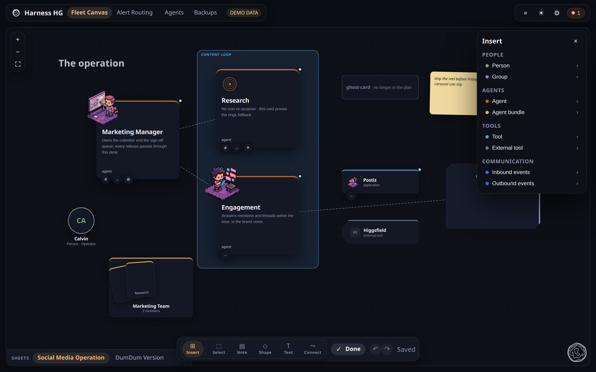
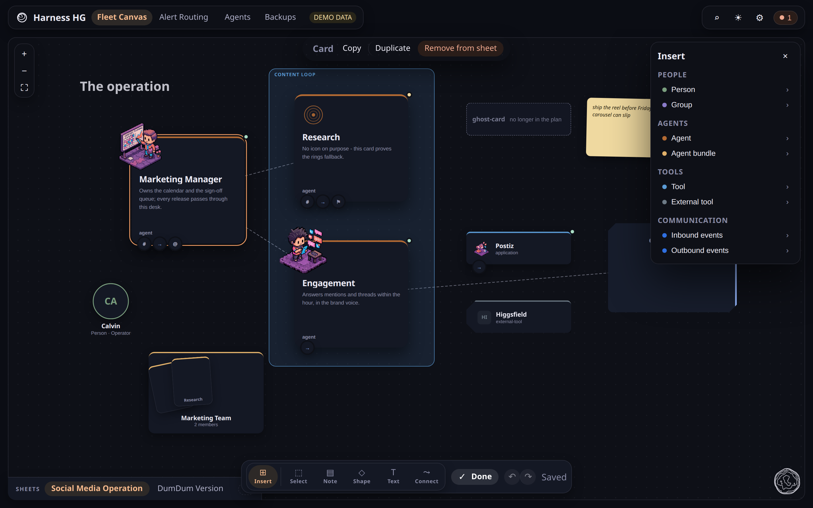

# Objects and interactions

**What this page tells you:** everything you can put on a sheet, and everything you can do
to it.

Two families. **Semantic objects** are things in your operation. **Canvas objects** are
drawing.

## Semantic objects

Eight kinds, and the set is frozen on the server as well as the browser.

| Kind | Family | Note |
|---|---|---|
| Person | People and groups | the only in-place editable semantic text: the role |
| Group | People and groups | |
| Agent | Agents | carries a health dot |
| Agent Bundle | Agents | rendered as a fanned hand of cards |
| Tool | Tools | carries a health dot |
| External Tool | Tools | no health dot, on purpose |
| Inbound events | Communication | |
| Outbound events | Communication | |

Most are projected from the plan. You can also place one from the Insert palette, which
lists the plan's components: drag its tile onto the board, or click to place it. The
position is authored; the health is the plan's.

Colour means **kind**, never status. Health has its own place on the card.

## Canvas objects

| Object | What you get |
|---|---|
| Sticky note | text on a tinted card, one size |
| Text | three sizes |
| Shape | a rectangle |
| Connection | a labelled line between two objects, drawn with the Connect tool |

Six fill tokens, no free hex. No stars, polygons, freeform paths, resize or rotation. This is
a whiteboard for reasoning about an operation, not a vector editor.

## Edit mode

The control island sits bottom-centre. **Edit board** at rest, **Done** while editing.
Editing reveals the rail: Insert, then Select, Note, Shape, Text, Connect.

## Interactions

| Action | How |
|---|---|
| Select | click; shift-click to add; shift-drag a marquee; Cmd/Ctrl-A for all |
| Move | drag; arrow keys nudge; shift-arrow nudges by the grid |
| Zoom | the wheel, anchored under the pointer, or the zoom island |
| Connect | the Connect tool: click one object, then the second |
| Copy, paste, duplicate | Cmd/Ctrl-C, Cmd/Ctrl-V, Cmd/Ctrl-D. Right-click pastes at the pointer |
| Delete | Delete or Backspace. Deleting many is one undo step |
| Undo, redo | the buttons in the control island |

## The card drawer

Selecting a projected card opens a drawer with what the plan knows: identity art, kind,
health, description and bundle membership. An absent field does not render. There are no
fabricated links or actions.

## Badges

A card carries badges for repositories, communication, IAM and alerting, joined from the
plan. The alerting bell means an alarm route targets the component and its health source is
configured. It never reads firing state.

## Where to go next

- [Nexus UI](index.md), projected versus authored, and saving
- [The other views](views/index.md)
