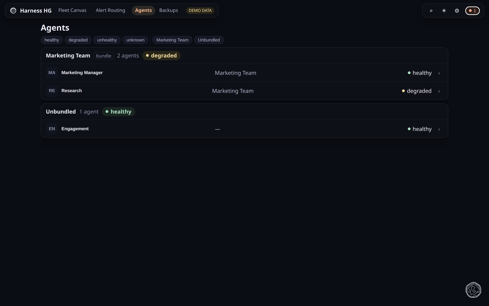
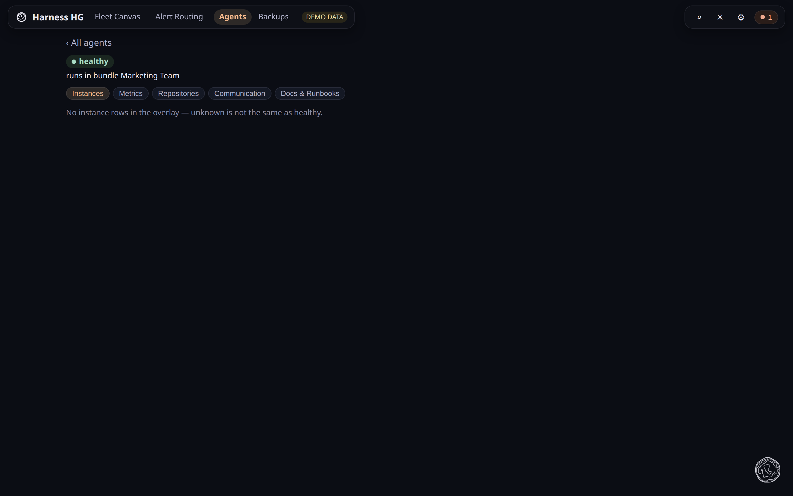

# Agents

**What this page tells you:** what the Agents directory shows, and where the detail lives.

Every agent, grouped by its bundle, leading with identity: avatar, name, deployment state,
and a repository cell. Model, instances, availability and eval results live in the detail,
not the row.

Click a row for the drawer. The chevron opens the same agent as a full page:

The Repositories tab says whether bindings are readable. Credentials never leave the
cluster. Eval results read `stale` after 168 hours.

## Where to go next

- [Repository mounts](../../agent-team-install/repositories.md), what a mounted repo declares
