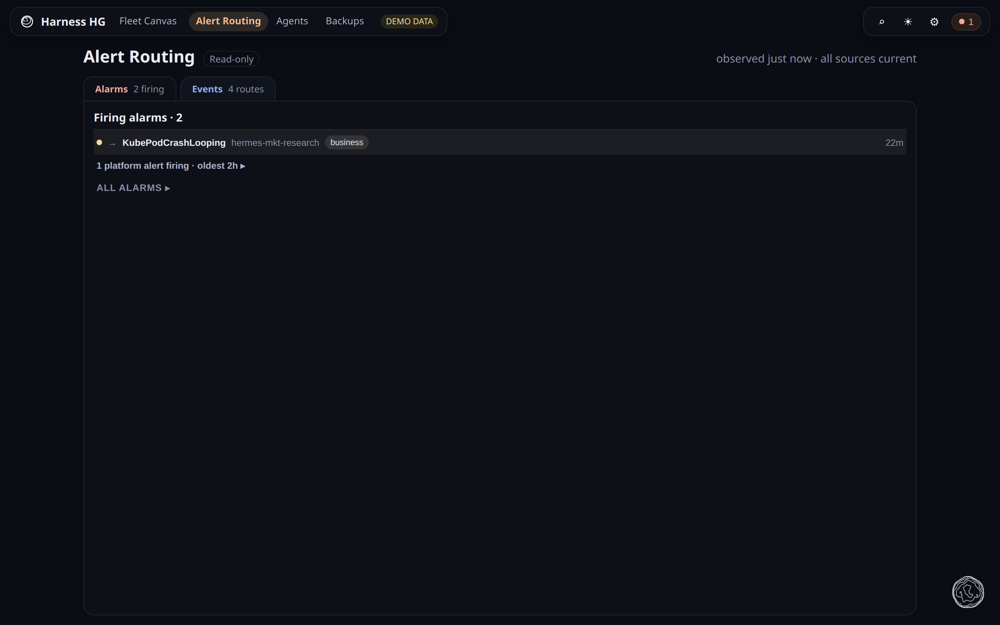
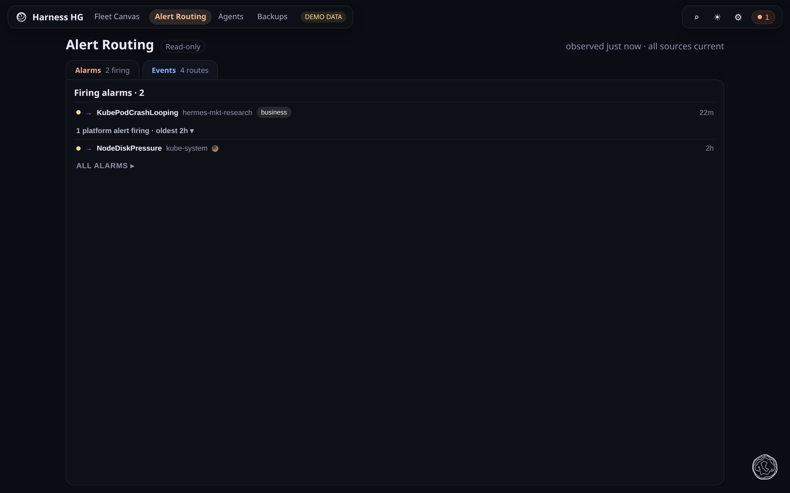

# Alert Routing

**What this page tells you:** what the Alert Routing view shows: what is firing, and whether
deliveries get through.

Two planes, split by event name. Anything under `observability.*` is an **Alarm**. Everything
else is an **Event**.

- **Alarms**: what is firing, and for how long. Read from both Prometheus and Grafana.
- **Events**: routes, and whether deliveries are getting through the durable queue.

Click a row for the drawer: severity, summary, first observed, the value, the rule's labels,
and a link to the rule when the platform serves one.

No firing history is drawn. Grafana keeps its own state history, not a queryable series.

## Where to go next

- [Alerts and alarms](../../platform/alerts.md), the delivery paths
- [Outbound events](../../platform/outbound-events.md), where the delivery records come from
