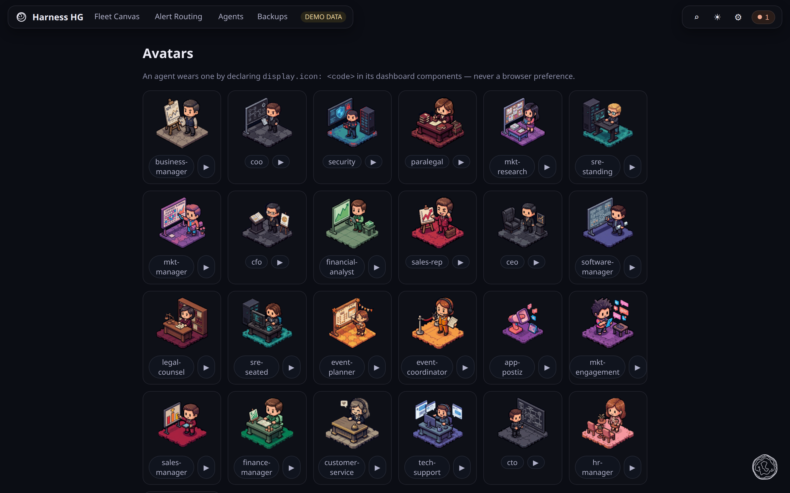

# Avatars

**What this page tells you:** what the avatar gallery shows, and how a repository names a
face.

One animated diorama per business role, each with a code, grouped by domain colour. Reach
the gallery from the settings menu. Put a code in an agent's `display.icon` and its card
wears it. An unknown code falls back to the plain card.

The faces are platform inventory. Your repository names one; it does not ship one.

## Where to go next

- [Signals](../../agent-team-install/signals.md), the declaration the code goes into
