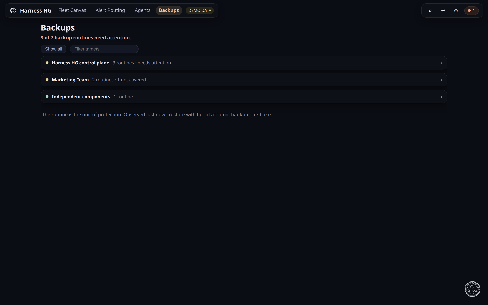
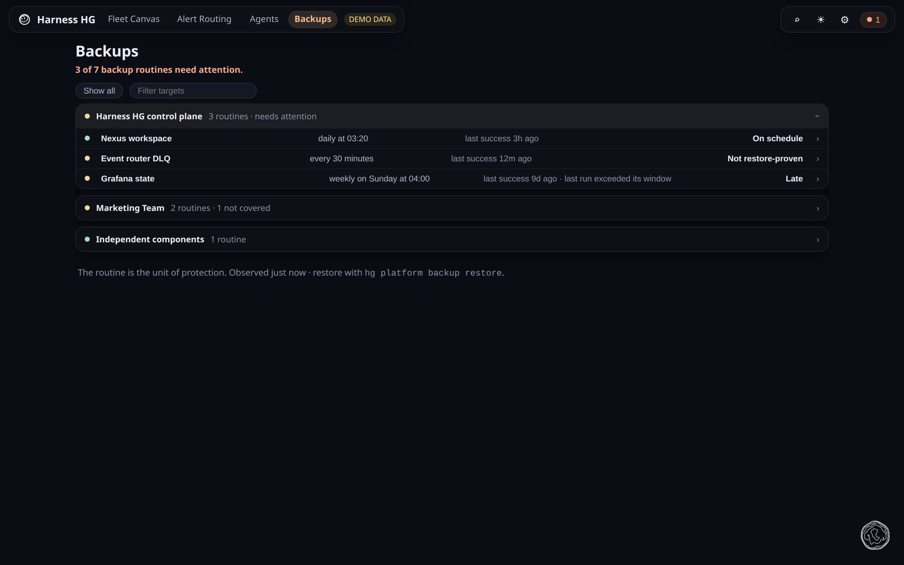

# Backups

**What this page tells you:** what the Backups view shows: what protects each installed unit,
and what nothing protects.

Organised by installed unit: the control plane, each bundle, and independent components.
The headline counts what needs attention, not what exists.

Each shelf expands to its routines, and a routine opens the drawer:

A component listed as **not covered** is one that nothing backs up. That is worse than a
routine that failed. Volumes that are deliberately not backed up show as **ephemeral** rows
with the reason. If every control-plane row says "platform backup record is Nh old", the
record was not republished: see [the status record](../../platform/backups.md#the-status-record-nexus-ui-reads).
Restores run from the CLI, not from here.

## Where to go next

- [Backup](../../platform/backups.md), how the routines work
