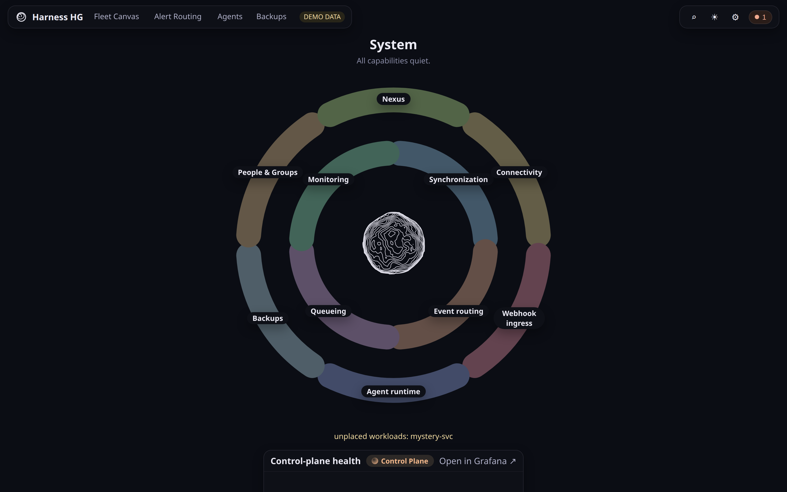
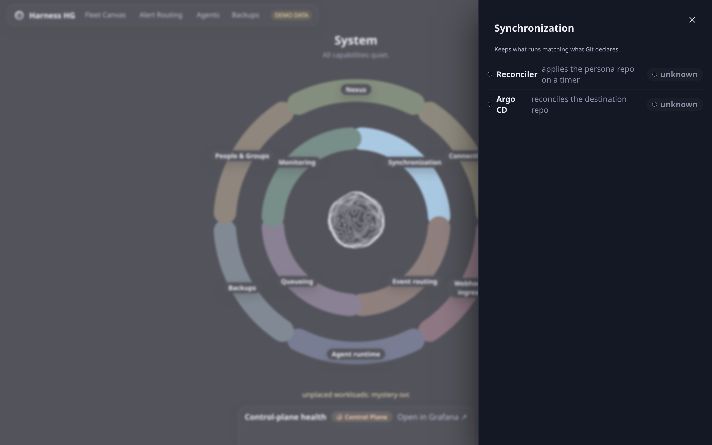

# System

**What this page tells you:** what the System view shows: the control plane as a ring of
capabilities.

Synchronization, monitoring, event routing, queueing, backups, agent runtime, connectivity,
webhook ingress, people and groups, and Nexus UI itself. Each arc opens a drawer naming the
workloads behind it:

Every capability here has a [Platform](../../platform/index.md) page. The arcs are the
fastest way to find which one you want.
