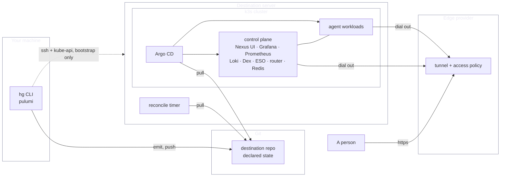

# Networking

**What this page tells you:** where things run, how traffic reaches them, and where the
trust boundaries are.

## The shape

In steady state everything crosses a boundary by pulling or by dialling out. The one inbound
path is your own SSH and kube-API access while `hg server` and `pulumi up` bootstrap the host.

## The pieces

| Piece | Runs where | Job |
|---|---|---|
| The CLI and Pulumi | your machine | compile declarations, push to Git, stand up the server |
| The destination repository | Git | the declared state, the only channel into the cluster |
| The reconcile timer | the destination host | pull the repository and apply on a loop |
| Argo CD | in-cluster | reconcile the repository into workloads |
| The control plane | in-cluster | Nexus UI, Grafana, Prometheus, Loki, Dex, ESO, the router, Redis |
| Agent workloads | in-cluster | one StatefulSet per agent, plus supporting workloads |
| The tunnel connector | in-cluster | dial the edge, carry inbound traffic back |

Argo CD, the External Secrets Operator and Nexus UI are Pulumi-installed at bootstrap. The
rest is Argo-reconciled.

## Four trust boundaries

- **Your machine → Git.** You push. Your credentials stay with you.
- **Git → cluster.** Argo CD and the timer pull. Compromising the repository changes what
  runs; it does not grant a shell.
- **Cluster → edge.** The connector dials out. No inbound port is opened. The edge
  terminates TLS and can see the traffic.
- **Edge → person.** The access policy lives here. A hostname with no policy is public.

## Inside the cluster

Service-to-service traffic is unauthenticated. Nexus UI reads Prometheus and the router that
way. Anything with a pod in the cluster can read those services. Treat pod admission as a
security boundary.

## Where things are exposed

| Exposed | Path | Protected by |
|---|---|---|
| Nexus UI, Grafana | the control-plane tunnel | the edge access policy |
| Agent endpoints | the shared control-plane tunnel | the edge access policy |
| Webhook hostnames | the same tunnel, no policy | the request signature at the origin |
| Everything else | not exposed | not reachable |

## Where to go next

- [Tunnels](tunneling.md), the inbound path
- [Webhooks](webhooks.md), the hostnames that let a machine in
- [Secrets](secrets.md), what crosses these boundaries and what never does
