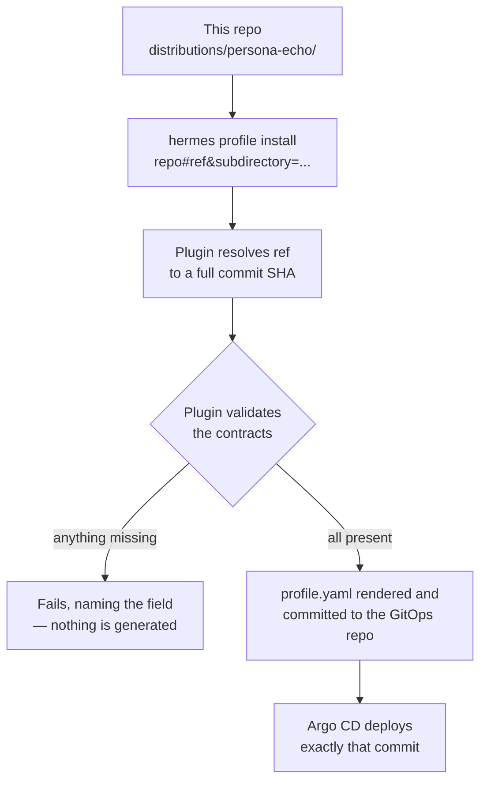

# Example: a distributed profile repository

**What this page tells you:** what a distributed profile repo is, how its folders are laid out, how the platform installs it pinned to a Git reference, and what gets checked before anything is rendered.

## What a distributed profile is

A **distributed profile** is an external Git repository that ships an AI agent's distribution — its manifest, personality, config, and deployment intent — so a Hermes GitOps platform can install it **by Git reference**. The author writes a few small files. No Kubernetes YAML, no Helm, no Dockerfiles. The author never has to know where the agent will run.

This directory is a mini version of such a repo. In real life it would be its own repository (for example `github.com/your-org/agents`), and the platform's fleet configuration would point at it.

## The layout

One repo can carry many distributions, each in its own folder under `distributions/`:

```
distributed-profile/                  # ← imagine this is the repo root
└── distributions/
    └── persona-echo/
        ├── distribution.yaml         # the manifest (required)
        ├── hermes-gitops.yaml          # deployment config (optional, platform-only)
        ├── SOUL.md                   # the agent's personality
        └── config.yaml               # runtime settings (user-owned)
```

| File | Required | What it does |
|---|---|---|
| `distribution.yaml` | yes | Self-describing manifest: name, version, supported Hermes versions (`hermes_requires`), required secrets and inputs (`env_requires`). |
| `SOUL.md` | yes | The agent's system prompt, in plain Markdown. |
| `config.yaml` | no | Model and runtime tuning. Preserved on update. |
| `hermes-gitops.yaml` | no | All deployment intent: the Helm `apps` the profile launches, plus `expose`, `deployment`, `backup`, and `gitAuthSecretRef`. Plain Hermes ignores it; the platform reads it. `distribution.yaml` stays pure Hermes — the plugin does not read extension blocks embedded there. |

Inside `hermes-gitops.yaml`, each `apps[]` entry is one Helm chart:

| Key | Required | Meaning |
|---|---|---|
| `name` | yes | DNS-label name, unique in the file. |
| `chart` | yes | Chart name (remote repo) or chart path in the platform tree (`repo: local`). |
| `repo` | yes | `local` (reserved word: ships with the platform), or an `https://` / `oci://` Helm repo URL. |
| `version` | remote only | Exact chart version. Required for remote repos; forbidden for `local`. |
| `values` | no | Inline chart values — the author's defaults. |
| `valuesRequired` | no | Dot-paths the operator must supply (via fleet or per-instance `appValues`). Checked before render. |

A distribution can also carry `mcp.json`, `skills/`, and `cron/`. See [Distributed profile config](../../_docs/wiki/reference/profile-record.md) for the full `hermes-gitops.yaml` key reference, [hermes-config](../../_docs/wiki/platform/reconciliation.md) for the file-by-file contract, and [packaging](../../_docs/wiki/platform/reconciliation.md) for the repo layout rules.

## How the platform installs it (pinned to a ref)

Every install is pinned to a Git reference — a branch, a tag, or a commit SHA (ADR-009). Whatever you give, the plugin resolves it to a **full commit SHA** and records that SHA, so the same record always deploys the same content.

```bash
# by tag, naming the subfolder:
hermes profile install "github.com/your-org/agents#v1.0.0&subdirectory=distributions/persona-echo" -y
```

In a fleet you do not run this by hand: the repo is listed in the platform's fleet configuration and `pulumi up` runs it for you.



## What is validated BEFORE rendering

Validation is fail-fast: the plugin checks both contracts **before** manifest generation. A half-configured agent never reaches Git, and never reaches the cluster.

| Check | What happens if it fails |
|---|---|
| Required secret in `env_requires` has no value in the platform's secret config | Fails, naming the variable and the exact `pulumi config set` command to fix it. |
| Unknown key in `hermes-gitops.yaml` (say `deplyoment:`) | Fails, naming the bad key and the allowed set. Never silently dropped. |
| An `apps[]` entry with a remote repo but no `version` | Fails, naming the app — remote charts must be pinned. |
| A `valuesRequired` dot-path still null after all value layers merge | Fails before render, listing each missing path and the exact override command. |
| Operator overrides a value the distribution never declared | Fails — the manifest is the full list of knobs. |

Note the shape difference: in `hermes-gitops.yaml`, an app's `values` are the author's defaults and `valuesRequired` lists what the operator still owes. The rendered [profile record](../../_docs/wiki/reference/profile-record.md) carries the **resolved** apps — all value layers merged into `values`, `valuesRequired` satisfied and dropped — plus the pinned `sha`.

## Scope in v1

Pod compute only, single cluster. Networking, backups, and placement are **platform** capabilities — this repo only *declares* what it needs (spec ADR-010). That is what keeps the profile portable: the same folder installs unchanged on any Hermes GitOps platform.

## See also

- [Packaging reference](../../_docs/wiki/platform/reconciliation.md) — layout rules and versioned refs.
- [Hermes config reference](../../_docs/wiki/platform/reconciliation.md) — every file in the contract.
- [Conformance](../../_docs/wiki/platform/testing.md) — the full "is this repo valid?" checklist.
