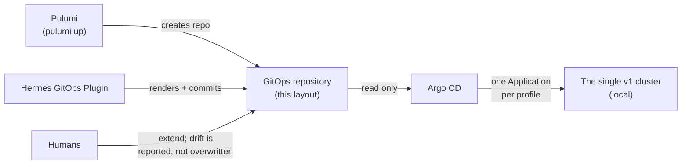

# Example: a rendered GitOps repository

**What this page tells you:** what a scaffolded GitOps destination repository looks like — after `pulumi up` creates the repo and the Hermes GitOps Plugin fills it in.

This directory is a snapshot, not a template you clone. The real repo is made for you:

1. **The emitter's scaffold creates** the GitOps repository (`python -m gitops_emitter.scaffold_cli`, driven by `hg env new`'s converged environment or the bootstrap program).
2. **The plugin initializes it.** It writes the layout you see here, fills in the `__UPPER_SNAKE__` placeholder tokens with your real values, and commits.
3. **Argo CD reads it** and makes the cluster match it, forever.
4. **You may extend it.** Add your own files and folders. If you hand-edit a plugin-managed file on purpose, the plugin does not overwrite you — it pauses and reports drift. Humans always win.



## The layout

```
gitops-repo/
├── bootstrap/
│   ├── project.yaml            # AppProject — the safety fence (allowed repos + destination)
│   ├── applicationset.yaml     # the factory: one Argo CD Application per profile
│   └── monitoring-stack.yaml       # platform kube-prometheus-stack (metrics, Grafana, Alertmanager)
├── values/
│   └── defaults.yaml           # value layer 1: platform-wide defaults
├── clusters/
│   └── local/
│       └── values.yaml         # value layer 2: the one v1 cluster's settings
└── profiles/
    └── persona-echo/
        └── profile.yaml        # value layer 3: one installed agent (plugin-written)
```

## What each part does

- **`bootstrap/`** is the Argo CD entry point. `project.yaml` says which repos may be synced and where things may land — including the **allowlist of remote Helm repos** that profiles' `spec.apps` may pull charts from (`local` apps need no entry; they ship with the platform). `applicationset.yaml` watches `profiles/*/profile.yaml` and generates one Argo CD Application per profile. Nobody commits Application manifests by hand. The two `monitoring-*.yaml` files install the platform's Prometheus + Grafana pair — their `valuesObject` blocks are the place you tune Grafana/alerting settings, as a normal Git edit (see the [monitoring guide](../../_docs/wiki/platform/observability.md)). The plugin owns this folder.
- **`values/defaults.yaml`** holds defaults every agent gets: the agent image, resource requests, and fleet-wide `appValues` (per-app value fragments that satisfy the apps' `valuesRequired` paths — see [Distributed profile config](../../_docs/wiki/reference/profile-record.md)).
- **`clusters/local/values.yaml`** describes the one cluster. The quickstart's cluster (k3d, minikube, or k3s) is registered under the name `local`. This is the file **you** edit — your ingress domain lives here.
- **`profiles/persona-echo/profile.yaml`** is one installed agent. It is plain Helm values (a single `spec:` block) — there is **no HermesProfile CRD**. The plugin generates it from the `persona-echo` distribution, the same example agent the [tutorial](../../_docs/wiki/runbooks/install.md) installs. Treat it as data, not as a file to hand-author.

## The three value layers

Each generated Application merges three value files, in order. The last file wins.

1. `values/defaults.yaml` — platform-wide defaults.
2. `clusters/local/values.yaml` — this cluster's settings.
3. `profiles/<name>/profile.yaml` — the agent's own record. Always wins.

Why keep a `clusters/` folder for just one cluster? Because the layers answer different questions. Layer 1 is "what every agent gets". Layer 2 is "what this cluster is like". Layer 3 is "what this agent wants". Keeping them apart means adding a second cluster later (the roadmap) changes the layout, not the model.

## What is *not* here — on purpose

- **No cluster registration folder.** v1 is **single cluster** ([spec, section 16](../../_docs/wiki/index.md)). Argo CD deploys to the same cluster it runs in, using its built-in in-cluster destination (`https://kubernetes.default.svc`). An in-cluster destination needs **no cluster Secret at all**, so there is nothing to register.
- **No placement split.** Older drafts split profiles into `pinned/` (one named cluster) and `fleet/` (every matching cluster). That split only exists to route between clusters. With one cluster there is nothing to route, so every profile sits directly under `profiles/`.

## Placeholder tokens

`__UPPER_SNAKE__` tokens (like `__GITOPS_REPO_URL__`) are stand-ins the plugin replaces once, when it initializes the repo. In your real repo you will see your actual URLs and versions instead. The token alphabet shares no characters with Argo CD's `{{ }}` Go templates, so the replacement can never corrupt them.

## Read more

- [ops quickstart](../../_docs/wiki/get-started/host-an-environment.md) — the `pulumi up` walk that produces this repo.
- [The GitOps repository](../../_docs/wiki/reference/repo-scaffolds.md) — who creates it, who writes to it, and why.
- [Drift](../../_docs/wiki/platform/reconciliation.md) — the rules for humans and automation sharing one repo.
