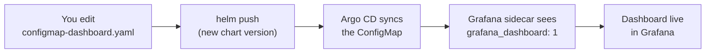

# How to build Grafana dashboards on this platform

**What this page tells you:** how a dashboard gets from a Helm chart into
Grafana here, the handful of rules every dashboard follows, and a copy-paste
recipe for adding a panel. Read it before you change
`templates/configmap-dashboard.yaml`.

## There is no "import a dashboard" step

You never click **+ Import** in Grafana. A dashboard on this platform is a
**Kubernetes ConfigMap** with one label:

```yaml
metadata:
  labels:
    grafana_dashboard: "1"
data:
  my-dashboard.json: |
    { ...dashboard JSON... }
```

The platform Grafana runs a **sidecar** that watches every namespace for that
label. When your Argo CD app syncs the ConfigMap, the sidecar loads the JSON
inside it as a dashboard — within seconds, no Grafana restart. Delete the
ConfigMap and the dashboard disappears. This is why the whole thing lives in a
chart: shipping a dashboard is just shipping YAML.



## The five rules

1. **Query the shared datasource by uid.** Every profile reports into one
   Prometheus. Its Grafana datasource uid is `prometheus` (set in
   `values.yaml` as `datasourceUid`). Put that uid on every panel and every
   target. A wrong or missing uid gives you a panel that renders but stays
   empty — the most confusing failure there is.

2. **Keep the dashboard uid stable.** Grafana identifies a dashboard by its
   top-level `uid`. This chart derives it from the profile namespace so it
   never changes between renders. If you make the uid depend on something that
   changes (a timestamp, a random value), every sync creates a *new*
   dashboard and orphans the old one.

3. **Scope every query to this profile.** Never write a query that sums across
   all profiles. Filter by the namespace label
   (`namespace="hermes-<persona>"`) for pod/app metrics, or by the Traefik
   service regex (`<namespace>-.*@kubernetes`) for web traffic. The
   `_helpers.tpl` in this chart builds both for you.

4. **What fires is what you see.** If a number matters enough to alert on, put
   the *same query* on the dashboard and draw the alert threshold as a line
   (see the traffic panel — `thresholdsStyle: line`). When someone asks "why
   did this page me?", the dashboard should already answer it. The standard
   alerts live in `charts/monitoring`; mirror their queries here.

5. **Version every change.** Registries reject re-pushing the same chart
   version, and Argo CD caches by version. Bump `version` in `Chart.yaml`
   (and the matching `apps[].version` in `hermes-gitops.yaml`) whenever you
   touch the chart, then `helm package` + `helm push`.

## Recipe: add a panel

Panels are objects in the `panels[]` array of the dashboard JSON. Copy this,
give it a **unique `id`**, and place it with `gridPos` (the grid is 24 columns
wide; `x`/`y`/`w`/`h` are in grid cells):

```json
{
  "id": 5,
  "type": "stat",
  "title": "Agent ready pods",
  "gridPos": { "x": 0, "y": 26, "w": 6, "h": 6 },
  "datasource": { "type": "prometheus", "uid": "prometheus" },
  "targets": [
    {
      "refId": "A",
      "datasource": { "type": "prometheus", "uid": "prometheus" },
      "expr": "sum(kube_statefulset_status_replicas_ready{namespace=\"hermes-<persona>\"}) or vector(0)",
      "instant": true
    }
  ]
}
```

Common panel `type`s: `timeseries` (a line over time), `stat` (one big
number), `gauge`, `table`, and `text` (Markdown — how the teaching panels on
this dashboard are built). Keep the `or vector(0)` on counters so a panel
shows `0` instead of "No data" before any traffic arrives.

## See also

- `_docs/wiki/platform/observability.md` — the platform's standard dashboard +
  the three alerts every profile gets.
- `charts/monitoring` — the reference implementation these conventions come
  from (dashboard **and** alert rules in one chart).
