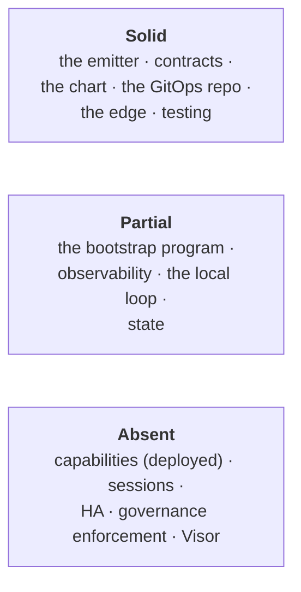

# How this system is actually built

**What this page tells you:** where to find the truth about each part of the running system, the one
path that crosses all of them, and which parts nothing verifies.

Design describes where the platform is going. This section describes
where it is. **When the two conflict, this section is correct.**

Evidence is cited as `path:line`. Anything without evidence is not claimed.

## Summary



One page per build unit. The **Gate** column is the load-bearing one: it says what would catch a
regression, and two rows say nothing would.

`landing/` is the one row that is not part of the running system at all — it is a static page about
it, kept here so the claims it makes are reviewed beside the code that would falsify them.

`hg launch prove` (#285) is the gate over all of them. It adds no subject checks — every milestone
built its own matrix and each is the authority on its subject — and asserts the one thing no subject
owns: whether the installation is in its launch configuration. A subject that could not run reports
`unknown`, never a pass.

| Page | Directory | Gate | State |
|---|---|---|---|
| The emitter | `plugin/gitops_emitter/` | `make pytest` (`tests/test_layout.py` pins the agent-team fold to byte-identical records) | **Solid** — both layouts (ADR 0178); a `src/` payload with no contract refuses |
| The contracts | `agent-bundle-contracts/` | `make schema-validate` (404 fixtures, both directions) + `make docs-drift` (the generated field reference) | **Solid** — 21 groups; `agent-team/v1alpha1` (ADR 0178) is the authored surface of an agent-team repo, its readers land in the follow-on changes |
| The topology compiler | `cli/src/topology/` + `cli/src/layout.ts` | `bun test` (offline; `tests/layout.test.ts` pins the agent-team fold to the legacy contract) | **Partial** — full CLI surface incl. the agent-team layout (ADR 0178); trees have no Argo consumer |
| Nexus UI (rebuilt) | `nexus-ui/` → `control-plane/nexus/` | nexus-ui CI job (typecheck, 195 tests incl. style gates, the workspace wire-contract fixtures (`tests/fixtures/workspace-wire*.json`, read by `tests/wire.test.ts` AND the plugin-API suite's `TestWorkspace` — the gate over the browser↔server document boundary), theme drift, the self-hosted fonts gate `tests/fonts.test.ts`, dist byte-compare, size budget, sync check) + `NX_BROWSER=1` acceptance matrix (incl. five fixture-gated edit-mode probes) + 393 plugin-API tests | **Built** — the shipping frontend since the #732 flip: all screens per the `_docs/design/nexus-ui/` spec, five stores, top-layer overlays, served-plane badges, the 2026-09-02 edit-tools correctness pass (disarm-on-place, keyboard history, selectable wires, pointer capture, space-pan, shape variants, note/shape corner resize + text size steps) and the 2026-09-03 final pass (dead global-search stub removed, ADR 0179; Alert Routing's patch-bay switchboard drill-down consuming latestExecution + the ADR-114 history endpoint, ADR 0180 — alertHistory rendering deferred to the roadmap). Parked extras in #728; live-loop prove rides #670 |
| Nexus | `cli/src/nexus/`, `control-plane/nexus/` | `bun test` + `make pytest`, `make chart-test` (nexus goldens + `sync-nexus-chart.sh --check`, which refuses a projected dist file), `cd infra && bun test tests/nexus.test.ts` (the three bundles reach the `nexus-ui-dist` ConfigMap), plus `hg grafana prove` / `hg auth prove` (cluster) | **Partial** — four launch views (Fleet, Communication, Agents, Backups), all seven overlay sources, OIDC authorization from verified claims, and embedded Grafana panels from a server-owned allowlist (ADR-44 now Accepted). Open: no eval panel exists to catalogue, and the cross-site/HTTPS embed path is #300 |
| The communication plane | `cli/src/topology/{communication,envelope}.ts`, `cli/src/communication/` (incl. its `prove.ts`), `control-plane/event-router/chart/` | `bun test` + `make chart-test` golden + `hg communication prove` (cluster) | **Solid locally** — compiles, emits, routes, queues (FIFO/DLQ/replay), gates external webhooks, delivers to Slack; Discord and other chat providers are roadmap-only (ADR 0183) |
| The endpoint chart | `harness/hermes/charts/hermes-endpoint/` | `make chart-test` goldens | **Partial** — ingress+none; cloudflare refused |
| [Profile record reference](../_docs/wiki/reference/profile-record.md) | *generated* | `make docs-drift` | **Solid** |
| The bootstrap program | `infra/src/` | `bun test` (incl. the K7 agent-team check and the install script's contract-dir export, ADR 0178) | **Partial** — 2 cluster providers unverified; the agent-team layout's half is built: `agentInstanceName` skips the `src` payload segment, stage 2 clones the source at the sha and exports `HERMES_GITOPS_CONTRACT_DIR` for a `/src` subdir |
| The destination-host reconciler | `cli/src/reconcile/`, `infra/src/components/reconciler` | `cd cli && bun test tests/reconcile.test.ts` | **Partial** — pulumi apply + https fetch unexercised (ADR-54 Cost) |
| The GitOps repository | `infra/gitops-template/` | `make gitops-template-validate` | **Solid** — ownership undeclared |
| The profile chart | `harness/hermes/charts/hermes-profile/` | `make chart-test` | **Solid** — the legacy runtime (ADR-149) |
| The eve chart | `harness/eve/charts/{eve-agent,eve-bundle}/`, `harness/eve/image/` | `make chart-test` goldens `eve-*`, `bundle-eve-*` + guards and negatives; `make eve-boot-test` (Docker: image, boot convergence, route contract, credential rotation); `cli/tests/versions.test.ts` pin parity; `cli/tests/backup.test.ts` Eve contract block; the cloudflare/ingress **byte-equality** assertion in `render-test.sh` (cloudflare must add nothing per-instance) | **Partial** — the agent runtime (ADR-149) with its backup routine, child Applications, workspace bindings and the bundle chart (ADR-150); durable state relocated out of the checkout; proven on the local loop including a restore round-trip, not on a live Argo ApplicationSet or factory-server; `justbash()` only. Reaches the Cloudflare edge over the shared control-plane tunnel (ADR-156), with no per-instance tunnel and no author-declared exposure. **`make eve-boot-test` is not wired into CI** (`ci` is disabled repo-wide, `.github/workflows/DISABLED.md`): a regression in the pod's boot or route contract is caught by a developer running the target locally, by nothing else |
| The eve emitter | `plugin/gitops_emitter/harness/eve.py`, `plugin/gitops_emitter/emit_cli.py`, `agent-bundle-contracts/eveagent/v1alpha2/` | `make pytest` (`test_eve.py`, `test_emit_cli.py` against a local bare repo); `make schema-validate` fixtures | **Solid** — push-driven; resolves `apps` through the Hermes pipeline's `resolve_apps` (`--app-values`), copies `backup`; publishes through the same `publish_record` as the Hermes hook |
| The eve bootstrap component | `infra/src/components/harness/eve-agent/` | `cd infra && bun test` (`eve-agent.test.ts`); the emit script run against local repos | **Partial** — no stack has run it through `pulumi up` yet |
| `hg` for Eve agents | `cli/src/harness/eve/` (`protocol.ts`, `driver.ts`, `prove.ts`), `cli/src/lib.ts` (`RUNTIME_PREFIX`, ADR-151 naming), `cli/src/platform/profile-bundles.ts` (runtime), `cli/src/workspace/` (Eve layout), `cli/src/topology/contract.ts` discovery | `cd cli && bun test tests/{eve,profile-bundles,workspace,topology}.test.ts`; `hg agent prove [--deep]` EVE001..023 live; `hg agent evals` | **Built locally** — every Eve surface resolves a bundled member through one placement function, and since 2026-09-01 the STANDALONE branch names from the runtime it is rather than the state file (`resolvePlacement` returned `hermes-<name>` for any Eve agent the local state had not onboarded — `eve.test.ts` was red on every machine but the author's); EVE001–023 pass on the example (EVE014 an honest `unknown`), both bundle members pass EVE001–011 |
| Chat conversations | `infra/src/components/slack-workspace/`, destination-owned Slack channels | `hg slack prove`; destination Slack handler tests | **Built** — Slack apps, credentials and event subscriptions; user mention round-trip remains a live check |
| The harness registry (ADR-153) | `cli/src/harness/{index,types}.ts` + `eve/` and `hermes/`; `plugin/gitops_emitter/harness/`; `infra/src/components/harness/` | `cd cli && bun run typecheck && bun test`; `make pytest`; `cd infra && bun test`, including **`module-paths.test.ts`** — it scans for paths built from `import.meta.dirname` and asserts each resolves, which is the gate the move itself lacked (a broken one reached main and failed `pulumi preview` on factory) | **Built locally** — one directory per surface holds every runtime driver, and `harness/index.ts` is the only place `hg` branches on a runtime. `hg agent show|exec|prove|evals` dispatch (ADR 0177); `apply` refuses on Eve with the reason. Charts and images deliberately stay outside it (ADR-153 Cost) |
| The agent runtime manifest (ADR-153) | `agent-bundle-contracts/agent-runtime/v1alpha1/`, `cli/src/harness/{manifest,resolve}.ts`, `harness/eve/charts/{eve-agent,eve-bundle}/templates/configmap-runtime-manifest.yaml` | `cd cli && bun test tests/harness-manifest.test.ts` (builder + the diff's key-order trap); `make schema-validate` fixtures incl. a secret-VALUE negative; `make docs-drift`; **`hg agent prove` EVE022** compares the mounted copy with the offline resolve field for field | **Built locally** — mounted at `/hg/runtime-manifest.json` on both bundle members and proven equal to `hg agent inspect`. Two producers can still drift between a chart edit and a CLI edit: only EVE022, and only where an agent is deployed, catches it |
| The edge | `infra/src/components/cloudflare-ingress/`, the in-cluster tunnel program (`infra/pulumi/programs/cloudflare-tunnel/`) | `bun test`, `cloudflare-tunnel-test` | **Solid** — one provider |
| Observability | `control-plane/{monitoring,observability,fleet-dashboard,loki}/`, the observer-metrics plugin in `harness/hermes/charts/hermes-profile/files/plugins/` | partial — `render-test.sh` goldens + refusals cover `control-plane/monitoring/chart`; `helm lint` covers loki | **Partial** — logs exist since Loki/promtail (ADR 0165) but are not on factory yet (#703); no SLOs |
| External uptime | `uptime/` *(deleted)* | — | **Deleted** 2026-08-25 (#678, the final-pass first cut) — the Gatus compose config and its 6 tests went unreplaced; what survives is the commented `external-uptime` scrape job in the gitops template and the overlay's uptime source |
| The state backend | `state/` | **none** | **Partial** — manual root of trust |
| The local loop | `cli/` | `hg launch prove` (LAUNCH001..006, aggregating every subject matrix) | **Partial** — now serves its own OCI registry and GCS emulator so persona charts and cloud sinks are exercised offline (#304 records what that does *not* prove) |
| Profile bundles | `cli/src/platform/profile-bundles.ts`, `harness/hermes/charts/hermes-bundle/`, `harness/eve/charts/eve-bundle/` | `bun test` + `make chart-test` goldens (`bundle-*`, `bundle-eve-*`) | **Partial** — live on this host; an Eve realization since ADR-150 (homogeneous bundles, chart stamped into the record). The chart gained a backup routine, a NetworkPolicy and its first tests; five separate surfaces had been addressing bundled profiles by their retired per-profile names. Open: bundled members still get no monitoring app (#301) |
| Application charts | *(none — `charts/` deleted 2026-08-26, #672)* | `make test` `chart-boundary` (`infra/scripts/check-chart-boundary.py`, ADR 0163) refuses any chart outside its class's root; the `compat-copy` class itself is gone | **Built** — the boundary violation is over: application charts live only in persona repos, the compat trio is deleted, and the persona records pin the canonical paths (social-media.harness-hg#54) |
| The loop front doors (#673) | `cli/src/frontdoor.ts`, `cli/src/env/new.ts`, `cli/src/agent-bundle/`, `cli/loops/` | `cd cli && bun test` (dry-run transcript, scaffold tests); the agent-bundle loop runs green from an isolated home; `make quickstart-drift` pins the docs to the runs | **Built** — `hg env new` (day-0, resumable, hand-executable dry run), `hg dev` onramp, `hg bundle init` (self-validating TEAM scaffold in the agent-team tree — `harness-hg/{team,destination,workspaces}.yaml` + `agents/eve/<name>/{harness-hg,src}`, ADR 0178; gate `bun test tests/agent-bundle.test.ts` + `make loop-agent-bundle`). The #676 scratch acceptance waits on the operator's §1 root bucket |
| The loop quickstarts (#675) | `_docs/wiki/get-started/` | `make test` (`quickstart-drift` + `wiki-build --strict` + `doc-links` + `retired-paths`) | **Built** — three intent-routed pages, each opening with its front door and ending in its loop's proof; no second onboarding narrative survives |
| The environment spec (#674) | `cli/schemas/environment/v1alpha1/`, `cli/src/env/`, `infra/environments/` | `make test` (`schema-validate` fixtures, `env-drift` regenerate-and-compare, `cli/tests/env.test.ts` round-trip/quoting/ciphertext) | **Built** — the factory imported value-identical; #358 unreachable from the spec; secrets never leave the generated projections |
| The e2e proof surface | `infra/scripts/{e2e-offline,record-cmp}.sh` | `make test` via `e2e-offline`; `record-cmp` is operator-run (`make record-cmp REF_A=<ref> REF_B=<ref>`) | **Built** — source → emit → destination with no cluster (#669), including a must-fail leg (`distributed-profile` must refuse) and the cross-repo persona acceptance; deployment-neutrality is a command that byte-compares every persona record across two refs, not a hand procedure |
| The loop walkthroughs | `cli/loops/` | agent-bundle: `make test` (`e2e-offline` runs the same chain; `make loop-agent-bundle` runs the script itself); dev: `make e2e` nightly via `live-loop.yaml` — **dormant until #737**; ops: operator-run against a live environment | **Partial** — the three loop walkthroughs are executable (#670, ADR 0170), but the ops loop asserts the post-day-0 prove segment only, skips the #740 local-loop-shaped legs, and day-0 stays a by-hand procedure until #674/#676 |
| Connections (ADR-152) | `cli/src/connection/` (`compile.ts`, `command.ts`), `agent-bundle-contracts/environment-connections/`, the three agent charts' `connections.yaml`, `control-plane/event-router/chart/files/router.ts` (`/v1/connect/*`) | `cd cli && bun test tests/connections.test.ts tests/router.test.ts` (Ed25519 + HMAC verifiers, routing, verbatim forward); `make schema-validate`; `hg connection prove` CONN001–004 live | **Built locally** — declared once, projected through the `hermes-gitops` ClusterSecretStore, verified and routed by the router; both provider chains proven end to end on the k3d loop with locally minted keys. Not at the factory edge (no published hostname / Access policy) |
| Slack workspace (ADR 0174 + 0175) | `infra/src/components/slack-workspace/` (provision + events Commands, state-carried secrets), `extraSecrets` in `infra/src/components/agent-secrets/`, `parseSlack` + the 0175 ownership cross-check in `infra/src/control-flow/config.ts`, `plugin/gitops_emitter/slack{,_cli}.py` (`provision-app`/`apply-manifest`/`sync-bot-token`), `cli/src/slack/prove.ts` | `cd infra && bun test tests/slack.test.ts tests/config.test.ts` (parser, manifest determinism, provision-stdout contract, secret-ownership refusal); `uv run --group dev pytest -q plugin/tests/test_slack_cli.py` (the cracked `developerInstall` shape, create-strips-events, `PULUMI_COMMAND_STDOUT` carry-forward, named-fix errors); `cd cli && bun test tests/slack-prove.test.ts`; `hg env plan factory`; live: `hg slack prove <env>` SLK001..004 | **Solid, live-proven 2026-08-29** — all three factory apps recreated through the provision path inside `pulumi up` (signing secret + bot token captured into encrypted state, ADR 0175; the cracked `developerInstall` shape proven against live Slack), secrets merged into the env Secrets, pods rolled, events attached after the 401-readiness probe, old apps deleted; `hg slack prove factory` SLK001..004 green and all three twins answer @mentions in-thread |
| The Hermes backup contract | `harness/hermes/charts/hermes-profile/templates/pod/backup.yaml`, `harness/hermes/charts/hermes-bundle/templates/backup.yaml` | `cli/tests/backup.test.ts` contract drift guard + `make chart-test` goldens | **Built** — the contract is written down from upstream's own `hermes_cli/backup.py`; the regenerable and host-namespaced sets are excluded; every `*.db` is snapshotted via `sqlite3.backup()` + integrity check with the sidecars excluded (#436, ADR-106, BKUP008); no deployed profile configures an external memory provider and `topology doctor` guards the day one does (#437) |
| Platform recovery | `cli/src/backup/platform.ts`, `infra/scripts/test-recovery.sh` | `bun test`/typecheck offline (incl. `tests/backup-status-publish.test.ts`, which runs the real status-namespace lookup against a config file — the gate that was missing when #691 broke the lazy require); the rehearsal live; `hg launch prove`'s recovery subject | **Partial** — CMEK sink + identity split + timers built; the real bucket has no live run yet |
| The destination server | `cli/src/server/bootstrap.ts`, `infra/scripts/server/` | `cd cli && bun test tests/server-bootstrap.test.ts tests/versions.test.ts` | **Partial** — preflight + pinned bootstrap; the ssh path has no automated run |
| The landing page and devlog ([landing.md](landing.md)) | `landing/` | **none** | **Built, and ahead of the CLI** — a brochure site behind a sticky bar (ADR-133): a one-screen hero keeping the rolling `hermes-hg <verb> <target>` demonstration (six commands `hg` does not have — ADR-70 gates launch on them, and the binary is not called `hermes-hg` either) and the shapes it draws in the ADR-58 grammar, three value sections, a centered close with the live mark, five feature pages, a features overview, an about page, and four devlog entries. Light by default since ADR-130; fonts vendored since ADR-132; no external requests. No build step; every claim hand-maintained across thirteen documents (ADR-69, ADR-133) |
| Tests, gates and CI | `infra/scripts/`, `.github/workflows/` | is the gate | **Solid** |
| What one Cloudflare token creates | `infra/src/components/cloudflare-ingress/` | `hg edge prove` | **Solid** — nine resources, and the human-token/runtime-token split stated |
| Creating the GitOps repository | `plugin/gitops_emitter/scaffold.py` | `make verify-git-side`; `uv run --group dev pytest plugin/tests/test_scaffold.py` (hash-gated reconcile, incl. the cluster-values → project.yaml allowlist render); `infra/scripts/check-source-repos.sh` | **Solid** — seeded once, managed files reconciled hash-gated (ADR-37); the environment's `appProject.sourceRepos` is rendered into `project.yaml` on every reconcile (`__OPERATOR_SOURCE_REPOS__`), so operator allowlist entries survive it |
| Control-plane tiers and versions | `infra/src/control-flow/control-plane.ts` | — | **Documented** — three tiers, three authorities; the tier-2 version gap is stated, not closed |
| Governance and ownership | `CODEOWNERS`, `LICENSE` (Apache-2.0, #455); `CONTRIBUTING.md` and `SECURITY.md` were deleted in the final-pass first cut (#678) | — | **Documented, not enforced** — the surviving rules exist in writing; this repo's `main` has no branch protection (checked live 2026-08-26), CI is dormant (#737), and the platform-path manifest (#173, #179) does not exist. The GitOps repo's protection is a different story — see gaps, tooling-and-security |
| [Gaps, deviations and defects](gaps.md) | — | — | the comparative layer |

## The path from a command to a running pod

The one narrative that crosses every subsystem. Each hop is owned by the page named beside it.

```
hermes profile install
  → plugin/gitops_emitter/__init__.py       _on_profile_install() — the
                                            registered profile_install hook   [emitter]
  → plugin/gitops_emitter/harness/hermes.py emit(): read intent → check
                                            secrets → merge defaults,
                                            extension, overrides →
                                            resolve_apps → build_record →
                                            validate                          [emitter]
  → plugin/gitops_emitter/gitrepo.py        publish() — commit or PR          [emitter]
  → the GitOps repository                   profiles/<name>/profile.yaml      [gitops-repository]
  → bootstrap/applicationset.yaml           git-files generator, one
                                            Application per record            [gitops-repository]
  → harness/hermes/charts/hermes-profile    StatefulSet + one child
                                            Application per spec.apps[]       [profile-chart]
```

Four facts about this path are not obvious from any single file:

- **The record is plain Helm values.** One top-level `spec:` block — no `apiVersion`, no `kind`, no
  custom resource definition. Every field under `spec:` is *also* a valid chart value, which is why
  there is no translation step. Its identity is its **directory name**.
- **The ApplicationSet layers two value files in order**: `cluster-values.yaml` (the environment,
  WHERE) then `profile.yaml` (the application, WHAT). It uses a two-source Application whose second
  source has no `path` and exists only to give `valueFiles` a `$gitops/` root.
- **Pulumi runs three config-gated stages**: install Hermes and the plugin on the *operator host* →
  `hermes profile install` per agent → install the in-cluster control plane. Stages 1–2 use
  `local.Command` and need no Kubernetes provider at all.
- **Hermes runs on the operator host, not in-cluster.** There it is a git client that renders
  records. The only Hermes *in* the cluster is the agent container. **There is no
  `hermes-agent-gitops` Helm chart in this repository** — that string names the upstream Python
  fork.

## What has no gate

First, the honest frame: **with all three workflows `disabled_manually` since 2026-08-05
(#737, `.github/workflows/DISABLED.md`), nothing fails a pull request automatically.** Every
gate on this page is something a developer runs. The table below names the units whose gate is
weakest even under that frame.

| Build unit | What exists | What runs it |
|---|---|---|
| `cli/` | full `cli/tests/` bun suite + typecheck | **Local-only until #737** — ci.yaml's `cli-test` job is kept correct but dormant; `make test`'s `e2e-offline` drives the CLI end to end but runs none of the unit suites |
| `state/` | `tests/config.test.ts`, 7 tests | Nothing — no CI job exists for it, dormant or otherwise |
| `charts/` | 3 compat-copy charts (#672) | `chart-boundary` polices placement only; the trio's own templates are untested — the render goldens gate the maintained twin `control-plane/monitoring/chart` |

`uptime/` left this table by deletion (2026-08-25, #678), not by gaining a gate. `state/` still
has tests that nobody invokes — a different problem from having none, and a cheaper one to fix.

There is also no meta-check that a new build unit arrives with a gate, which is how these
arrived without one.

## Reading the design against this

The numbered design pages 01–17 are gone (#604 retired them; `_docs/design/` was recreated
2026-08-25 as `platform.md`, `vocabulary.md`, `cli.md`, the `nexus-ui` set and
`landing-docs-repo.md`). `gaps.md`'s spine is keyed the same way, so
`gaps.md#platform-contracts` is a guessable link; each gaps section still notes the old
number it carried.

| Design page (section) | Realised by | Not realised |
|---|---|---|
| `platform.md` (overview) | bootstrap-program, gitops-repository | [drift stops automation, single-unit versioning](gaps.md#platform-overview) |
| `platform.md` (authorities) | emitter, gitops-repository, edge | [thin env repo, tree ownership, all-PR](gaps.md#platform-authorities) |
| `platform.md` (`agent-bundle-contracts/`) | contracts | [generated types, digest pinning, lock manifest, promotion](gaps.md#platform-contracts) |
| `platform.md` (capabilities + topology) | edge, topology, endpoint-chart, gitops-repository *(plan-level capabilities + endpoint types)* | [record propagation, deployed enforcement, sync readiness, external Argo CD, cloudflare endpoint mode](gaps.md#platform-capabilities) |
| `platform.md` (secrets, observability) | observability, bootstrap-program | [rotation lifecycle, alert semantics, SLOs](gaps.md#platform-secrets-observability-and-alerting) |
| `platform.md` (eventing, sessions) | communication-plane | [sessions, memory, the per-agent stream](gaps.md#platform-eventing-sessions-and-memory) |
| `platform.md` (runtime, HA, DR) | profile-chart, eve-chart, state-backend | [HA, restore verification, RPO/RTO reporting](gaps.md#platform-runtime-availability-recovery-and-data) |
| `cli.md` (tooling, loops, security) | local-loop, loop-walkthroughs, testing-and-ci | [validate/conformance, mock env, two identities, workload identity, environment-portable prove](gaps.md#cli-tooling-and-security) |
| `landing-docs-repo.md` (lifecycle, governance, OSS) | applications, landing | [rollback, acceptance checks, contribution/security docs, release model, Visor](gaps.md#oss-lifecycle-governance-and-adoption) |
| `nexus-ui.md` + `nexus-ui/` (the MVP contract) | nexus, nexus-ui, backup, observability, evals, local-loop | [restore automation, GCS live run, SSO hostnames, cross-site embeds, browser RBAC proof](gaps.md#nexus-ui-the-mvp-and-recovery) |

The eventing row's realising page covers the transport only — sessions and memory have no
realising directory, and that is the honest answer rather than a gap in this index: they are
not code yet, so there is nothing to document.

## How to read and edit these pages

**One fact, one owning page.** A `path:line` citation appears on the page that owns its directory
and is cross-referenced from elsewhere, never restated. A fact stated twice will diverge.

**Every hand-written page has the same sections, in this order:** What it is · Files · How it works
· Contracts · Failure modes · What is not there · Where this diverges from the design · Verified by
· See also. A `<!-- covers: -->` comment at the top names the directories the page owns.

**Cite a symbol name beside the line number** — `` `emitter.py:465` `emit` `` — because line
  numbers
rot and **nothing verifies them**. There is no citation checker; `make wiki-build` validates links
and anchors only.

**Negative claims still need evidence.** "Nothing does X" should say what was searched. An
unqualified absence is the easiest kind of claim to get wrong and the hardest to notice.

**`profile-record-schema.md` is generated.** Never hand-edit it; run `make docs`. `make docs-drift`
fails the build if it is stale.

See `_docs/README.md` for the full editing contract, including the 100-column wrap rule and the
anchor-target headings that `--strict` does check.
